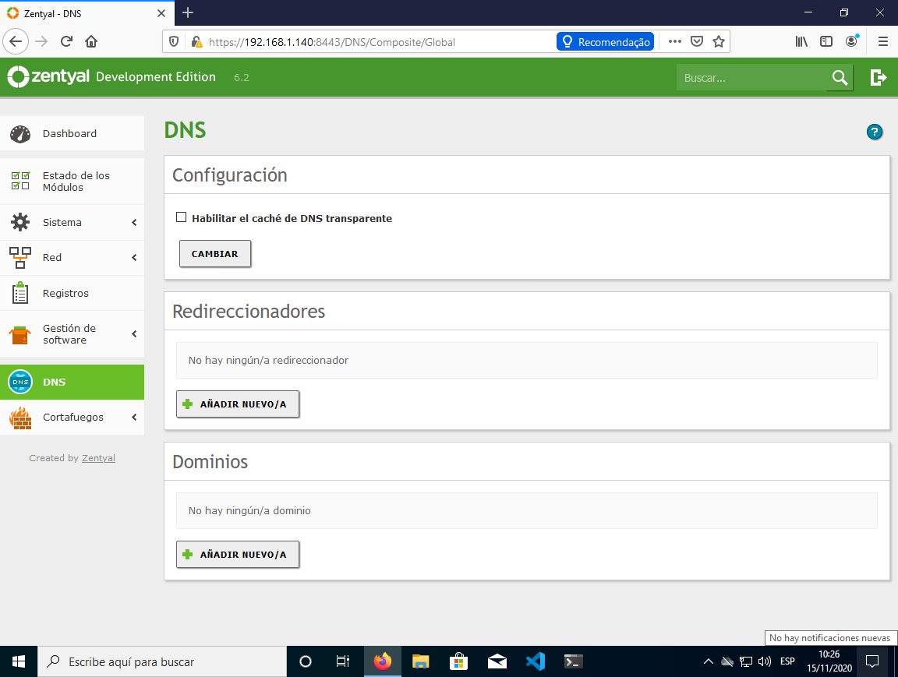
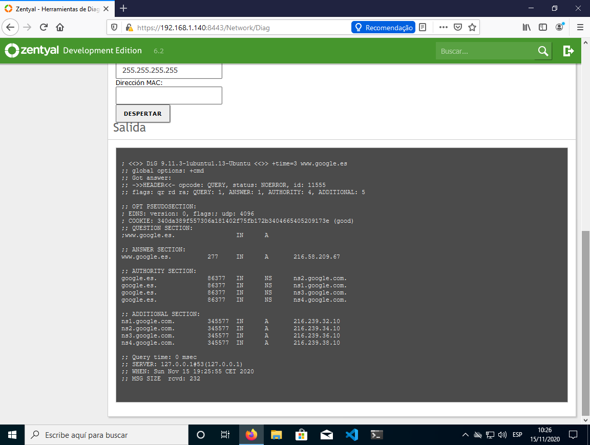

# PRÁCTICA 03. DNS en Linux (Zentyal)
>IES Celia Viñas (Almería) - Curso 2020/2021    
>Módulo: SRI - Servicios de Red e Internet     
>Ciclo: CFGS Administración de Sistemas Informáticos en Red  

### Punto 1. CONFIGURACIÓN PREVIA
Siguiendo la configuración de máquinas virtuales que vimos en el tema inicial, vamos aconfigurar un servidor DNS en la máquina de Zentyal.
### Punto 2. INSTALAR SERVICIO
1. Instala el módulo DNS, si no lo está, y lo activamos.


```
Imagen 1.  DNS Zentyal - Módulo DNS Zentyal
```
### Punto 3. EJERCICIOS
1. Utilizar el servidor como sólo ​caché​. Por defecto, al instalar el servicio DNS, este actúacomo sólo caché, es decir, no es autorizado a ninguna zona y responde a consultas recursivas.

a. Ahora podremos comprobar el funcionamiento de la caché a través de laherramienta ​Resolución de Nombres de Dominio ​disponible en ​Red ‣Herramientas. Haz varias consultas desde el servidor ​a la misma dirección y comprueba como se decrementa el tiempo de consulta.


```
Imagen 2.  DNS Zentyal - Resolución de Nombre de Dominio
```


```
Imagen 3.  DNS Zentyal - Resolución de Nombre de Dominio
```
b. Configura el cliente windows y ubuntu con ip fija y que tengan como servidorDNS la dirección del servidor.


```
Imagen 4.  DNS Zentyal - DNS Ubuntu
```


```
Imagen 5.  DNS Zentyal - DNS Windows
```
c. En windows usa la orden ​nslookup​ y realiza consultas a diversos dominios deinternet (​www.google.es​, ​www.mec.es​, ​www.ual.es​ ...)


```
Imagen 6.  DNS Zentyal - nslookup Windows
```
d. En ubuntu y con la orden ​dig​ realiza las siguientes pruebas:

```bash
dig [@servidorDNS] NombreDominioAConsultar [tipoConsulta]
#dig @TuIPServidorDNS www.ual.es (Consulta tipo A: la ip degoogle.es)
#dig @TuIPServidorDNS www.ual.es a (Consulta tipo A: la ipde google.es)
#dig @TuIPServidorDNS www.ual.es ns (servidores de DNS degoogle.es)
#dig @TuIPServidorDNS www.ual.es mx (servidores de correo degoogle.es
#dig @TuIPServidorDNS www.ual.es soa (consulta l registro dela zona google.es)
#dig @TuIPServidorDNS www.ual.es any (Todas las consultasa,ns,mx,soa,...)
#dig @TuIPServidorDNS -x 193.147.117.38 (consulta inversa IP--> nombre)
```


```
Imagen 7.  DNS Zentyal - dig www.ual.es
```


```
Imagen 8.  DNS Zentyal - dig www.ual.es a
```


```
Imagen 9.  DNS Zentyal - dig www.ual.es ns
```


```
Imagen 10.  DNS Zentyal - dig www.ual.es mx
```


```
Imagen 11.  DNS Zentyal - dig www.ual.es soa
```


```
Imagen 12.  DNS Zentyal - dig www.ual.es any
```


```
Imagen 13.  DNS Zentyal - dig -x 193.147.117.38
```


e. Añadir como redireccionadores DNS 1.1.1.1 y 8.8.8.8


```
Imagen 14.  DNS Zentyal Redireccionadores
```
2. Crear y configurar el servidor como primario en una zona de resolución directa.

a. Vamos a crear una ​Dominio​ para nuestra red local que se llamará: tunombre.sri


```
Imagen 15.  DNS Zentyal Dominio jacobo.sri
```
b. En direcciones IP del dominio añadimos las Ip’s del propio servidor.


```
Imagen 16.  DNS Zentyal Dominio jacobo.sri dirección IP
``` 
c. Parte inicial SOA
➢Nombre del servidor principal para que sea ns.tunombre.sri  
➢Contacto: tunombre.tunombre.sri  
➢Serial: 20191112  
➢Refresh: 604800  
➢Retry: 86400  
➢Expire: 2419200  
➢TTL negativo 10800 


```
Imagen 17.  DNS Zentyal Dominio db.jacobo.sri 
``` 


```
Imagen 18.  DNS Zentyal Dominio db.jacobo.sri 
```

d. En el registro servidores de nombres (NS) configuramos uno nuevo que seans.tunombre.sri (la propia máquina)

e. Establece los registros de tipo A (nombres de máquinas) para las siguientes direcciones:
➢ns.tunombre.sri → la IP del servidor (dos registros, uno por cada IP) 
➢tunombre.sri → la IP de tu máquina anfitriona.  
➢pcXX.tunombre.sri → 192.168.22.X (dónde XX es la IP de uncompañero)  
➢router.tunombre.sri → 192.168.22.100 (Ip del router)  
➢win.tunombre.sri → 10.0.X.X (ip de tu máquina cliente windows)  
➢ubuntu.tunombre.sri → 10.0.X.X (ip de tu máquina cliente ubuntu)  


```
Imagen 19.  DNS Zentyal Nombres de máquinas
```


f. Establece los siguientes registros de alias (CNAME): 
➢mail → a la máquina ubuntu  
➢ftp → al router  
➢www → a tunombre.sri (máquina anfitriona)  
➢nombrecompañero → a la máquina del compañero.g.Establece el registro para servidor de correo (MX)  
➢tunombre.sri → mail (ubuntu)  


```
Imagen 20.  DNS Zentyal mail
```
3. Comprobar en cliente Ubuntu (debe estar configurado con ip fija) el funcionamiento del servidor DNS en el dominio de cada uno tunombre.sri con el comando ​dig​.

a. Que resuelve todos los nombre y alias.

b. Que resuelve dominio externos.

c. Que hace resolución inversa